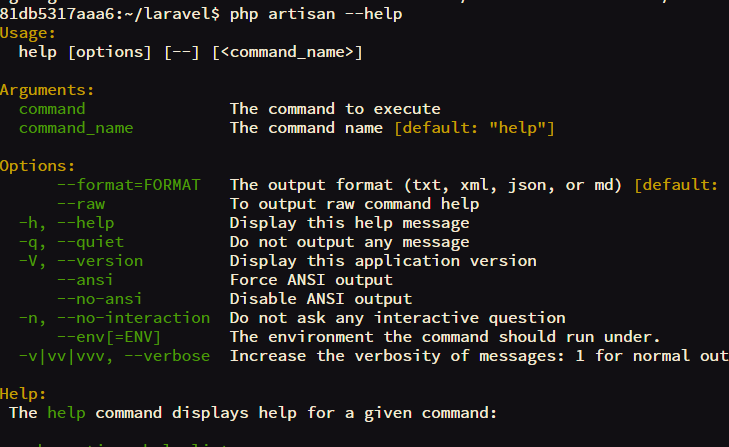

[](https://quay.io/repository/pooya/laas)
[](https://imagelayers.io/?images=pooya/laas:latest 'Get your own badge on imagelayers.io')

# Laas ( Laravel As A Service )
Painless and Automated Laravel Docker instances Hosting and Deployment.   
Laas is developed under inspiration of [Laravel Forge](https://forge.laravel.com) Project, which allows you deploy and host your laravel projects wihout any configuraion. Laas is Free, Self Hosted and More powerful.
  
# Features
- Production ready And fully dockerized environment for hosting Laravel applications.
- All Data is independent of container, just delete and create an new one any time you want.
- Powered by **Nginx**, **PHP7-FPM** on light **Alpine Linux**.
- **Webhooks** are ready ! Just push and commit your changes and your site is up!
- PHP **Mongo** extension compiled.
- **SSH-Keys** are auto-generated for git access.
- Very **Light**, no database running inside container.
- WebUI Shell Access Using [**Butterfly**](https://github.com/paradoxxxzero/butterfly)

# Webhook

Simply set `WEBHOOK_SECRET` environemnt and use injected url `http://project_url/webhook.php?secret=123` to use webhook.   
if you want to add custom commands, create a `.webhookrc` script in root of your laravel project.  

# Butterfly
   
Butterfly is a xterm compatible terminal that runs in your browser. [See Here](https://github.com/paradoxxxzero/butterfly)   
You can use a real **web based** console for your container. just set `PASSWORD` environment variable and access your server using `butterfly.*` subdomains. login username is `www-data`.   




# Quick Start

Simple Docker-Compose :

```yaml
version: '2'
services:
  laravel:
    image: quay.io/pooya/laas
    command: https://github.com/some/repo.git
    volumes:
      - ./data/www:/var/www
    environment:
      -  VIRTUAL_HOST=my.subdomain.tld,butterfly.my.subdomain.dld
      -  PASSWORD=www-data_password
      -  WEBHOOK_SECRET=123
    restart: always
    network_mode: "bridge"
```


